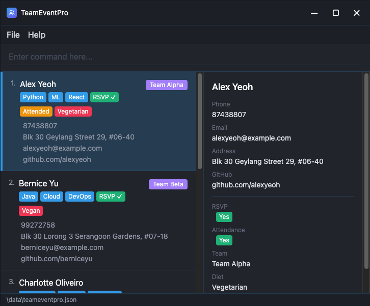

[](https://github.com/AY2526S2-CS2103T-W11-1/tp/actions)



**TeamEventPro** is an upgraded version of the Address Book Level 3 (AB3) app. It helps organizers of small tech meetups in Singapore track 20–150 people super fast using **keyboard typing only**.

## What problem it solves

Tech meetup organizers often rely on spreadsheets or slow websites during busy events. They need to quickly check who’s coming (RSVP), who eats vegan, who’s on which hackathon team, and skills like “Python.” TeamEventPro lets them type simple commands to get answers instantly—no mouse needed. That can save around 2 hours per event so they can focus on running the meetup.

## Who it’s for

**Tech event hosts** in Singapore. We add features just for them, like linking GitHub profiles or scoring hack teams.

## What it does

- **From AB3:** Names, phones, emails
- **Event-specific:** RSVP yes/no, food needs (e.g. vegan), skills (Python/ML), teams
- **Quick stats:** e.g. who didn’t show up, top skills
- **Singapore-focused:** MRT reminders, local time
- **100% keyboard-driven:** All typing, with simple on-screen highlights—no mouse clicks

## What it doesn’t do

TeamEventPro is not for large 1000-person conferences, paid ticketing, room booking, or non-tech events. It’s built for small tech meetups (20–150 people).

## Quick start

1. Ensure you have **Java 17** or above installed.
2. Clone the repo and run with Gradle:
   ```bash
   git clone https://github.com/AY2526S2-CS2103T-W11-1/tp.git
   cd tp
   ./gradlew run
   ```
3. Type commands in the command box. See the [User Guide](docs/UserGuide.md) for all commands.

## Documentation

- [User Guide](docs/UserGuide.md) — how to use the application
- [Developer Guide](docs/DeveloperGuide.md) — architecture, design and contribution
- [About Us](docs/AboutUs.md) — project team

> This project is based on the AddressBook-Level3 project created by the [SE-EDU initiative](https://se-education.org).
